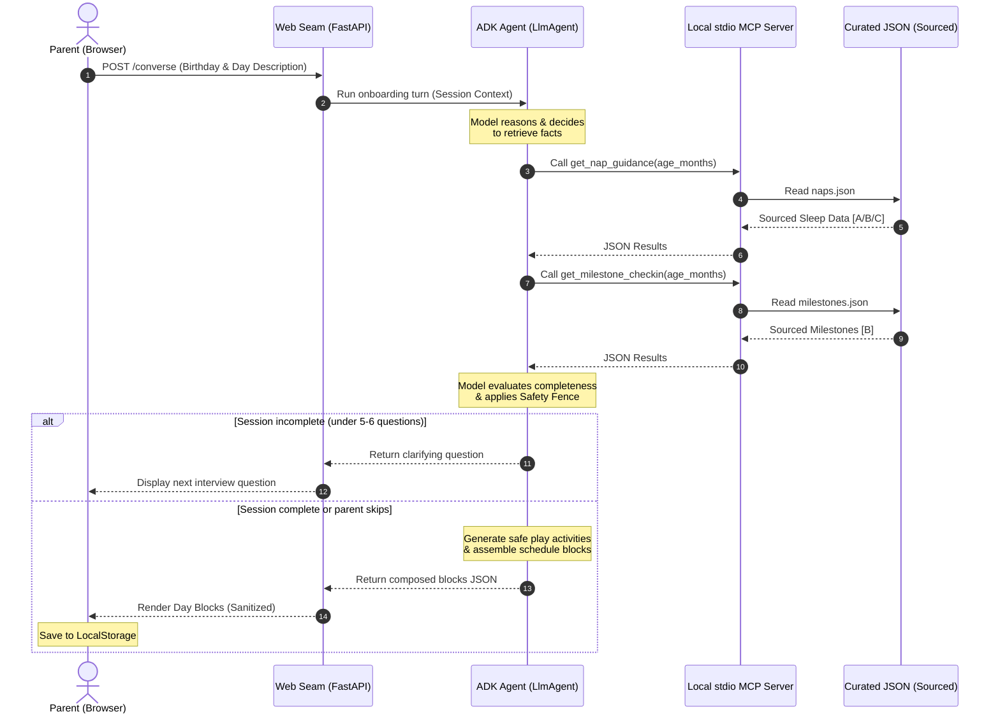

# Mom Day-Organiser: A Privacy-First Concierge Agent for New Parents

**Track:** Concierge Agents
**Submitting Team:** suja-capstone (Sujatha)
**Video Demo URL:** [YouTube Link (To be attached)]
**Project Demo URL:** [Cloud Run URL / GitHub Link (To be attached)]

---

## Executive Summary
**Mom Day-Organiser** is a privacy-first concierge agent built to solve a unique personal/family challenge: structuring the daily lives of new parents around the developmental stages of their babies. Traditional calendars and productivity planners optimize for *throughput* and assume the user owns and controls their own schedule. For new parents, this assumption is structurally incorrect. A parent’s available time is defined by caregiving windows, nap sequences, and childcare handoffs. 

By separating the user interface (a deterministic tracker) from the reasoning engine (a Google ADK agent) and grounding pediatric knowledge in a local Model Context Protocol (MCP) server, Mom Day-Organiser provides a protective, dynamic schedule. It guides the parent through a warm, clinician-like conversational onboarding, automatically restructures the day when babies hit developmental transitions (like dropping a nap), and generates age-appropriate play ideas—all while keeping personal data strictly local on the parent's device.

---

## 1. The Pitch: Problem, Solution, and Core Value

### The Problem
New parents operate under depleted cognitive load, sleep deprivation, and a daily calendar they do not control. Standard planners force parents to fit tasks into rigid hourly blocks, which leads to feelings of overwhelm and failure when a baby's unpredictable sleep cycles disrupt the plan. 
Furthermore, a baby's routine is highly dynamic; sleep windows and developmental milestones shift rapidly between 0 and 24 months. Traditional systems are static, requiring manual recalibration of schedules, while commercial baby trackers focus on logging past events rather than planning the day ahead.

### The Solution
Mom Day-Organiser shifts the scheduling paradigm. It organizes around the time the parent *doesn't* control—the baby's sleep and developmental needs—and adjusts as the baby grows. 

```
A generic planner helps you spend the time you control; this one organises around the time you don't — your baby's — and changes as your baby does.
```

### Why Agents?
A static scheduling app cannot reason about unstructured text, nor can it dynamically adjust schedules based on complex developmental transitions. An LLM agent, however, can act as a goal-directed orchestrator. When a parent inputs their day in plain text (e.g., *"I'm exhausted, my mother is coming from 10 to 1, and I need to polish one paragraph of my proposal"*), the agent:
1. Translates unstructured inputs into structural constraints.
2. Invokes deterministic knowledge tools to retrieve age-specific sleep windows and milestones.
3. Conducts a gentle, multi-turn interview to fill critical structural gaps without causing cognitive fatigue.
4. Synthesizes these variables into a cohesive, relative-time day plan.
5. Proactively restructures the day as developmental shifts occur.

---

## 2. Technical Architecture & Course Concepts

The project demonstrates five core course concepts: **ADK (Agent Development Kit)**, **MCP Server**, **Security & Privacy Features**, **Deployability**, and **Agent Skills**.



### Concept 1: Agent / Multi-Agent System (ADK)
The agent layer is built using the Google Agent Development Kit (ADK) `LlmAgent`. Rather than using a rigid, hardcoded pipeline of LLM calls, the agent's control flow is entirely model-driven. The agent is initialized with a system instruction that outlines its persona and behavioral constraints, equipped with the local MCP toolset, and guided by a declarative `compose-baby-day` Skill. The agent loops: it decides which tools to call, observes tool outputs, decides whether to ask a clarifying question, and composes the final day plan when ready.

### Concept 2: Local Stdio MCP Server
To guarantee the model never fabricates developmental facts, we built a local **Model Context Protocol (MCP)** server (`FastMCP`) using `stdio` transport. The server exposes two tools: `get_nap_guidance` and `get_milestone_checkin`. When the agent needs developmental sleep ranges or milestones, it spawns the MCP server as a subprocess and queries the tools. This decoupling ensures the knowledge lookup remains 100% deterministic and auditable.

### Concept 3: Security & Privacy Features
Parents are highly protective of their family's data. To ensure privacy, we implemented a strict boundary:
- **Zero-Storage Backend:** The FastAPI server holds conversations in-memory during onboarding but stores no persistent data.
- **On-Device Storage:** The parent’s schedule, tasks, progress, and the baby's exact birthdate are saved exclusively in the browser's `LocalStorage`.
- **Anonymized Tool Queries:** When the agent invokes MCP tools, it passes only the baby's age in integer months (e.g., `9`). No personal details, names, or schedules are ever sent to the MCP server or out to the model API.

### Concept 4: Deployability
The application is packaged into a single Docker container. The FastAPI application exposes the frontend and `/converse` API endpoints, while the backend agent automatically handles spawning and communicating with the stdio MCP server inside the same container. The container is deployed to **Google Cloud Run**. Because Cloud Run is serverless and scales down or across instances, we configure `--max-instances=1` and set session affinity. This guarantees that multi-turn onboarding sessions remain pinned to the warm memory of a single container instance during the user demo.

### Concept 5: Agent Skills
To separate the agent's core identity and rules from its procedural capabilities, we implemented the **Agent Skills** pattern. The onboarding and restructuring logic is codified in a discrete, runtime-loadable Skill definition: `compose-baby-day` (located at `agent/skills/compose-baby-day/SKILL.md`). The system instructions set the baseline persona and clinical safety rules, while the detailed schedule composition methodology, interview policies, and blocks JSON contract are dynamically loaded on demand and appended to the model's instructions at runtime via `build_compose_agent()`. This makes the agent's procedural methods modular and easily extensible without altering the core codebase.

---

## 3. Implementation Details: The "Facts Discipline"

Our core technical differentiator is the implementation of a strict **Facts Discipline**. In standard clinical or scheduling agents, models are given free rein to estimate windows, naps, or developmental advice. This leads to dangerous or incorrect information. In Mom Day-Organiser, the model is strictly forbidden from originating developmental facts.

### 1. Evidence-Tiered Knowledge Databases
We curated our developmental knowledge files (`naps.json` and `milestones.json`) from authoritative medical literature. Every record is explicitly tagged with a source and an evidence confidence tier:
*   **[A] Consensus Guideline:** E.g., American Academy of Sleep Medicine (AASM/AAP) or World Health Organization (WHO).
*   **[B] Research Literature:** E.g., Galland et al. (2012) systematic reviews on infant sleep, and Scharf et al. (2016) in *Pediatrics in Review* for milestones.
*   **[C] Practical Convention:** Common clinical sleep conventions (like wake windows) that are widely used but lack large-scale consensus clinical trials.

The agent's system instruction strictly mandates that sleep ranges and milestones must be phrased as *typical ranges* (never absolute prescriptions) and must trace directly back to the active tools.

### 2. Generated Play Activities vs. Grounded Facts
While sleep durations and developmental milestones are retrieved facts, **Play Activities** are creatively generated by the model. This is a deliberate distinction: games are not medical facts, and generating play ideas is a safe creative space. 
However, to ensure safety, this generation is bounded by a strict **Infant-Safety Fence** in the agent's instructions:
> Activities must be age-appropriate; carry NO small-parts, choking, or mouthing hazards; require caregiver supervision; stay within the baby's current motor stage (no unsupported sitting/standing if not yet achieved); and be framed strictly as a playful idea, never a developmental requirement.

### 3. The Clinical Parent-Wellbeing Persona
The agent's persona is designed to protect parent wellbeing:
- If a parent indicates exhaustion, illness, or overwhelm in the text, the agent bypasses complex routines and offers a **Minimum Day** (consisting of only one protected focus task and family evening time), reassuring the parent that doing one thing is a successful day.
- To prevent user fatigue, the onboarding interview is capped at a ceiling of **5 to 6 questions**, asked one at a time. The parent can skip or provide brief answers, in which case the agent fills gaps with sensible defaults and documents them.

### 4. Deterministic Render Guard
To prevent scheduling errors if the model outputs overlapping times, the frontend tracker applies a deterministic `sanitizeWindows()` routine. If the model accidentally assigns overlapping clock slots or zero-length blocks, the frontend automatically separates or filters them before rendering.

---

## 4. Evaluation and Verification

To ensure the Facts Discipline is maintained across code modifications, we built a deterministic **Evaluation Harness** (`pytest eval/`). The harness runs offline simulation checks on the agent:
1.  **Hallucination Detector:** Parses the LLM's conversation history and matches all developmental numbers (naps, sleep hours, milestone ages) against the values returned by the MCP tools during that session. If a number does not exist in the tool trace, the test fails.
2.  **Blocks Contract Verification:** Checks that the JSON returned by the agent strictly adheres to the schema expected by the tracker UI.
3.  **Tone Judge:** An optional LLM-as-judge test that evaluates agent responses against clinician warmth and checks if the agent correctly triggered a "Minimum Day" when presented with simulated parental overwhelm.

---

## 5. Reflections and Future Work

### Engineering Takeaways
*   **The Session State Challenge on Serverless:** Keeping conversation state in-memory on FastAPI is simple for prototypes, but serverless environments like Google Cloud Run require careful configuration (`--max-instances=1` and session affinity) to avoid split-brain conversations. A production-grade deployment would back session storage with a fast cache like Memorystore (Redis).
*   **Model Agnosticism:** Integrating LiteLLM as an optional wrapper in our ADK configuration allowed us to swap the model back-end to alternative providers with a single environment variable change. This saved development time when local testing reached free-tier rate limits.

### Future Work
In future iterations of Mom Day-Organiser, we plan to:
1.  **Extend Curated Domains:** Include feeding schedules (solids transition), safety checks, and motor developmental exercises.
2.  **Pediatrician Escalation Pathways:** Integrate developmental "Red Flags" from the AAP guidelines, formatting them as deterministic alerts that recommend pediatrician consultation without the model attempting a diagnosis.
3.  **Cross-Device Synchronization:** Implement encrypted, local-first syncing (using WebRTC or private user database containers) to share the day's routine seamlessly between parents and caregivers.

---

## Conclusion
Mom Day-Organiser proves that AI agents can act as empathetic, reliable concierge assistants when properly bounded. By placing clinical facts in deterministic MCP tools, keeping sensitive data local, and focusing the agent's creativity strictly on safe play activities and empathetic conversation, we have built a concierge system that respects parental boundaries, adapts dynamically to a child's growth, and provides genuine, everyday value.
